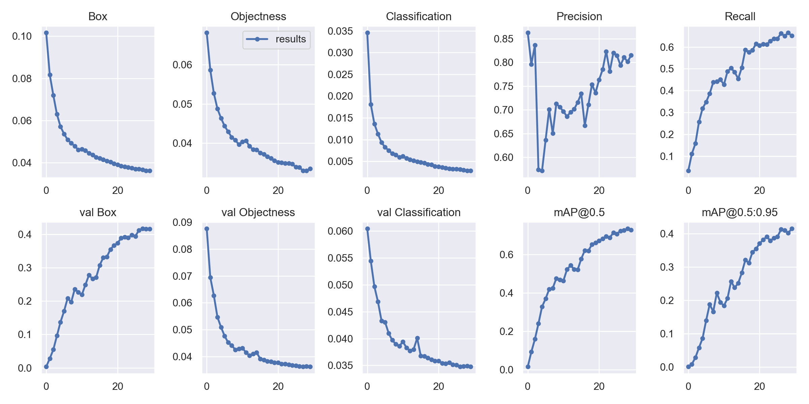
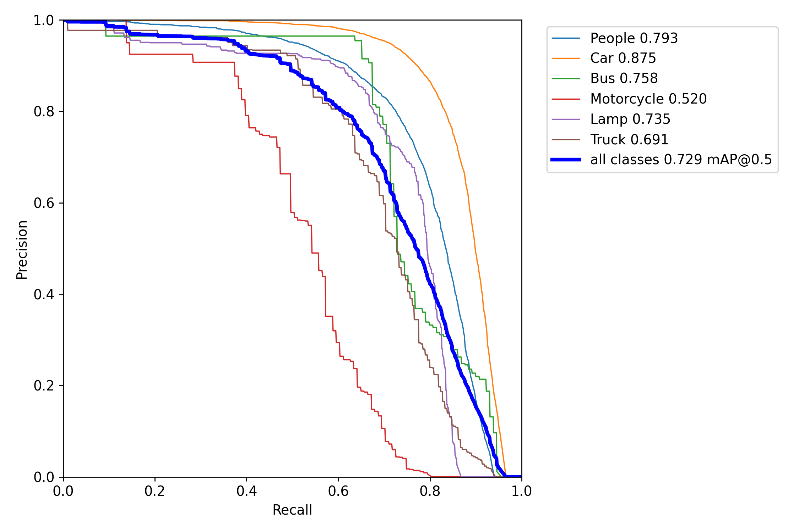
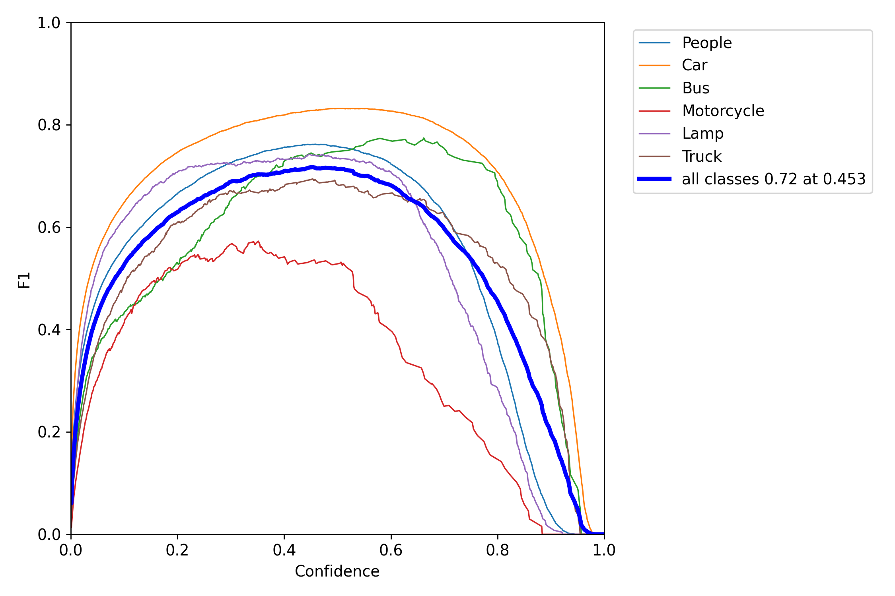
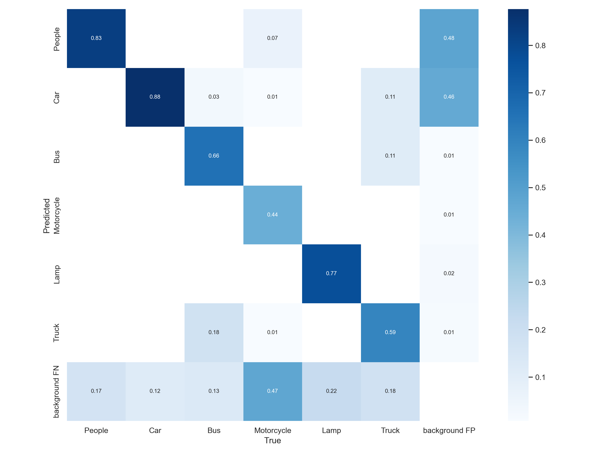

# 교차 모달 어텐션 기반 RGB-Thermal 영상 융합 객체 검출

## Cross-Modal Attention-Based RGB-Thermal Image Fusion for Object Detection

---

### 요약

본 논문은 가시광(RGB)과 적외선(Thermal) 영상을 교차 모달 어텐션으로 융합하여 보행자 및 차량을 검출하는 다중 스펙트럼 객체 검출 모델을 제안한다. 제안 모델은 각 모달리티에 독립 ResNet-50 백본을 할당하고, 채널 교차 어텐션과 공간 교차 게이팅으로 구성된 CMAFM(Cross-Modal Attention Fusion Module)을 통해 O(C) 복잡도로 상호 보완적 정보를 교환한다. M3FD 데이터셋에서 mAP@0.5 **73.7%**, Recall **87.4%**를 달성하였으며, RGB 단독 대비 mAP +10.5%p, Recall +4.5%p의 향상과 이중 백본(+5.0%p)·교차 모달 어텐션(+3.7%p)의 개별 기여도를 검증하였다. 특히 야간에서 mAP@0.5 **85.3%**, Recall **90.9%**로 주간 대비 각각 **+12.5%p, +3.9%p**를 달성하여 조도 불량 환경에서의 실질적 우위를 입증하였다. YOLOv5l 기반 CMAFM-YOLO 실험에서도 mAP@0.5 **73.5%**로 TarDAL(72.3%) 대비 +1.2%p를 달성하여 **검출기 독립적 융합 유효성**을 확인하였다.

**핵심어**: 다중 스펙트럼 객체 검출, RGB-Thermal 융합, 교차 모달 어텐션, 이중 백본, Faster R-CNN

### Abstract

This paper proposes a multispectral object detection model that fuses visible (RGB) and infrared (Thermal) images via a Cross-Modal Attention Fusion Module (CMAFM) combining Channel Cross-Attention and Spatial Cross-Gating with O(C) complexity. Experiments on M3FD achieve 73.7% mAP@0.5 and 87.4% Recall (+10.5%p and +4.5%p over RGB-only), with ablation studies confirming the contributions of dual-backbone (+5.0%p) and cross-modal attention (+3.7%p). Nighttime performance reaches 85.3% mAP@0.5 and 90.9% Recall, surpassing daytime by 12.5%p and 3.9%p, demonstrating the particular effectiveness of RGB-Thermal fusion in low-illumination environments. Applied to a YOLOv5l-based framework (CMAFM-YOLO) on the combined M3FD+FLIR dataset, the module achieves 73.5% mAP@0.5 — surpassing TarDAL (72.3%) and closely matching the Faster R-CNN-based CMAFM (73.7%), confirming detector-agnostic fusion validity.

**Keywords**: Multispectral Object Detection, RGB-Thermal Fusion, Cross-Modal Attention, Dual Backbone, Faster R-CNN

---

## I. 서론

자율 주행·군사 감시·스마트 시티 등에서 객체 검출은 핵심 기술이다[1]. RGB 카메라는 야간·안개·역광 조건에서 성능이 급격히 저하되고[2], Thermal 카메라는 조명에 독립적이나 텍스처 정보 부재로 유사 열 특성 객체를 구분하기 어렵다[3]. 기존 RGB-Thermal 융합 연구는 조기 융합·중간 수준 융합·후기 융합으로 분류되며, 중간 수준 융합이 가장 높은 성능을 보이는 것으로 보고된다[7]. 그러나 단순 Concatenation 방식은 모달리티 간 상호작용을 모델링하지 못하고, Transformer 기반 방법은 O(N²) 복잡도로 고해상도 적용에 제약이 있다.

본 논문은 이를 해결하기 위해 CMAFM을 제안한다. CMAFM은 N×N 어텐션 행렬 없이 채널 교차 어텐션(O(C))과 합성곱 기반 공간 교차 게이팅으로 전역·지역 수준 양방향 정보 교환을 달성한다. 주요 기여는 다음과 같다: (1) 메모리 효율적 CMAFM 설계, (2) 다중 스케일 이중 백본 아키텍처, (3) M3FD 데이터셋에서의 포괄적 실험 및 ablation study를 통한 구성 요소별 기여도 검증.

## II. 관련 연구

### 2.1 RGB-Thermal 융합 객체 검출

중간 수준 융합 방식으로 TarDAL[4]은 적대적 학습 기반 융합, Zhang et al.[5]은 반복적 융합-정제 블록을 제안하였다. Cao et al.[6]과 Qingyun et al.[10]은 Transformer 기반 교차 모달 융합을 시도하였으나, 전체 공간 어텐션의 O(N²) 복잡도로 고해상도 적용에 제약이 있다.

### 2.2 이종 센서 융합의 확장: RGB-Event 기반 연구

Dong et al.[15]의 MFFB는 ConvLSTM 기반 시간적 모델링과 Sobel 엣지 가이던스를 결합하여 DSEC-Lane 데이터셋에서 F1 81.57%를 달성하였다. MFFB와 CMAFM은 교차 어텐션 구조로 모달리티 간 보완적 특성을 활용한다는 설계 원칙을 공유하나, MFFB가 시계열 이벤트 스트림·차선 검출에 특화된 반면 CMAFM은 정합 정지 영상 쌍(RGB-Thermal)의 다중 클래스 객체 검출에 최적화된다. 이는 다중 스펙트럼 융합에서 센서 특성과 도메인에 따라 최적 아키텍처가 달라짐을 시사한다.

### 2.3 어텐션 기반 특징 융합

SENet[11]의 채널 어텐션과 CIAN[9]의 교차 모달 어텐션에서 발전하여, 본 논문의 CMAFM은 N×N 어텐션 행렬 없이 채널·공간 양방향 정보 교환을 O(C) 복잡도로 달성한다는 점에서 차별화된다.

## III. 제안 방법

### 3.1 전체 구조

제안 모델은 (1) 이중 백본, (2) CMAFM, (3) 검출 헤드로 구성되며, 동일한 CMAFM을 Faster R-CNN과 YOLOv5l 두 검출기에 적용하여 검출기 독립성을 검증한다(그림 1).

```
┌──────────────────────────────────────────────────────────────────────┐
│               CMAFM 기반 다중 스펙트럼 객체 검출 파이프라인                  │
└──────────────────────────────────────────────────────────────────────┘

  ┌──────────────┐              ┌──────────────┐
  │  RGB 영상    │              │ Thermal 영상 │
  │  (640×640)   │              │  1ch→3ch 복제│
  └──────┬───────┘              └──────┬───────┘
         ▼                             ▼
  ┌──────────────┐              ┌──────────────┐
  │ RGB Backbone │              │  IR Backbone │  ← 이중 백본 (독립 가중치)
  │  ResNet-50   │              │  ResNet-50   │
  │ C3/C4/C5    │              │ C3/C4/C5    │    256/512/1024ch
  └──────┬───────┘              └──────┬───────┘
         └──────────────┬──────────────┘
                        ▼   (스케일별 3회 적용)
         ┌──────────────────────────────────────┐
         │    CMAFM (교차 모달 어텐션 융합 모듈)      │
         │  [1] 채널 교차 어텐션  O(C) 복잡도      │
         │  [2] 공간 교차 게이팅  DWConv+Gate    │
         │  [3] 게이트 융합       잔차 연결        │
         └─────────────────┬────────────────────┘
              ┌────────────┴────────────┐
              ▼                         ▼
       ┌─────────────┐          ┌─────────────┐
       │ [경로 A]    │          │ [경로 B]    │
       │ FPN→Faster  │          │ PANet→YOLO  │
       │  R-CNN      │          │  Detect     │
       │ 73.7%/40.6% │          │ 73.5%/41.6% │
       │ mAP@.5/.5:.95│          │ mAP@.5/.5:.95│
       └─────────────┘          └─────────────┘
```

**그림 1.** 제안 모델 전체 구조. CMAFM이 C3/C4/C5 3 스케일에서 반복 적용되고, 동일 모듈이 Faster R-CNN(경로 A)과 YOLOv5l(경로 B) 양쪽에 결합된다.

### 3.2 교차 모달 어텐션 융합 모듈 (CMAFM)

CMAFM은 세 단계로 구성된다. **[1] 채널 교차 어텐션**: GAP으로 공간 차원을 압축한 후 교차 모달리티 dot-product 스케일링을 수행한다(O(C) 복잡도).

```
q_r = W_q · GAP(F_r),   k_t, v_t = split(W_kv · GAP(F_t))
scale = σ(q_r ⊙ k_t),   F_r' = F_r · (v_t · scale)    [RGB→Thermal, 양방향]
```

**[2] 공간 교차 게이팅**: DWConv+Conv1×1로 공간 특징을 추출하고, 상대 모달리티 맥락으로 게이트를 생성하여 관련 영역은 강화하고 무관한 영역은 억제한다.

```
S_r = Conv1×1(DWConv3×3(F_r')),   G_r = σ(Conv1×1([S_r; S_t]))
F_r'' = G_r ⊙ F_r'   [Thermal→RGB 동일 적용]
```

**[3] 게이트 융합**: 픽셀·채널별 독립 게이트 α로 적응적 가중 융합을 수행하고 잔차 연결로 안정성을 확보한다.

```
α = σ(Conv1×1([F_r''; F_t''])),   F_fused = α⊙F_r'' + (1-α)⊙F_t''
F_out = Conv3×3(F_fused) + F_fused
```

### 3.3 검출 헤드 및 학습 전략

융합된 C3/C4/C5 특징맵은 경로에 따라 FPN+Faster R-CNN 또는 PANet+YOLO 검출 헤드로 전달된다. 두 모델의 학습 설정은 표 2와 같다.

**표 2.** 두 모델의 학습 설정 비교

| 항목           | CMAFM (Faster R-CNN)                          | CMAFM-YOLO (YOLOv5l)                        |
| -------------- | --------------------------------------------- | --------------------------------------------- |
| GPU            | RTX A6000 (48GB)                              | RTX 4070 Laptop (8GB)                        |
| Framework      | PyTorch 2.4.0                                 | PyTorch 2.6.0, CFT 프레임워크                |
| Backbone       | ResNet-50 (ImageNet pretrained)               | YOLOv5l (scratch, 105M params)               |
| 가중치 초기화  | ImageNet pretrained                           | 무작위 (SPPF 비호환으로 pretrained 미사용)   |
| Optimizer      | SGD, lr=0.005, StepLR (/10 per 10 epoch)     | SGD, lr=0.01, Warmup 3ep, Cosine Annealing  |
| Batch / Epoch  | 8 / 30                                        | 4 / 30                                        |
| 데이터         | M3FD (train 3,360 / val 840)                  | M3FD+FLIR (train 7,486 / val 1,853)          |
| 데이터 증강    | 수평 반전, 밝기/대비 변환                     | HSV, 수평 반전, Mosaic                       |

> **CMAFM-YOLO scratch 이유**: CFT 프레임워크의 CMAFM 삽입으로 레이어 구성이 변경되어 YOLOv5 공개 가중치의 SPPF 레이어와 호환되지 않음. 사전 학습 가중치 적용 시 CFT(81.9%) 초과 가능성이 있다.

## IV. 실험

### 4.1 데이터셋

M3FD[14]는 4,200쌍의 정합 가시광-적외선 영상으로 6개 클래스(People·Car·Bus·Motorcycle·Lamp·Truck, 총 34,407개 객체)를 포함하며, 8:2로 분할하였다(1024×768, 학습 시 640×640 리사이즈). CMAFM-YOLO 학습에는 FLIR ADAS Aligned[18](5,142쌍, 640×512)을 추가하여 People과 Car를 보강하였다.

**표 1.** 데이터셋 구성 및 FLIR 보강 효과

| 구분              | M3FD  | FLIR ADAS | 통합 합계 | 보강 배율 |
| ----------------- | ----- | --------- | --------- | --------- |
| Train 이미지 수   | 3,360 | 4,126     | **7,486** | —        |
| Val 이미지 수     | 840   | 1,013     | **1,853** | —        |
| People 객체 수    | 11,477 | +13,094  | 24,571    | **×2.1** |
| Car 객체 수       | 18,296 | +24,732  | 43,028    | **×2.4** |
| 기타 클래스       | M3FD 전용 | 제외   | —        | —        |

FLIR의 bicycle·dog는 M3FD 매핑 클래스가 없어 학습에서 제외하였으며, COCO JSON 포맷을 YOLO 포맷으로 변환하여 사용하였다.

### 4.2 기존 방법과의 비교

평가 지표는 COCO 표준(mAP@0.5, mAP@[.5:.95], Recall, Miss Rate=1−Recall)을 사용하였다.

**표 3.** M3FD 데이터셋에서 기존 방법과의 성능 비교

| 방법                            | 검출기       | 융합 방식               | mAP@0.5   | mAP@[.5:.95] | Recall    |
| ------------------------------- | ------------ | ----------------------- | --------- | ------------ | --------- |
| RGB-only (baseline)             | Faster R-CNN | —                      | 63.2%     | 32.2%        | 82.9%     |
| Early Fusion                    | Faster R-CNN | 조기 융합               | 65.0%     | 33.5%        | 84.1%     |
| Dual+Concat                     | Faster R-CNN | 중간 (Concat)           | 70.0%     | 37.8%        | 85.6%     |
| TarDAL [4]†                    | YOLOv5       | 중간 (적대적)           | 72.3%     | —           | —        |
| CFT [10]†                      | YOLOv5       | 중간 (Transformer)      | 81.9%     | —           | —        |
| ICAFusion [17]†                | YOLOv5       | 중간 (반복 교차 어텐션) | 88.2%     | —           | —        |
| **CMAFM (제안, Faster R-CNN)** | Faster R-CNN | 중간 (교차 모달 어텐션) | **73.7%** | **40.6%**    | **87.4%** |
| **CMAFM-YOLO (제안, YOLOv5)**  | YOLOv5l      | 중간 (교차 모달 어텐션) | **73.5%** | **41.6%**    | **66.5%** |

† YOLOv5 기반으로 검출기 구조 상이 — 직접 수치 비교에 한계 있음. CMAFM-YOLO는 M3FD+FLIR 통합 데이터, scratch 학습, Epoch 28 best.pt 기준.

**핵심 해석:**
- **Faster R-CNN 계열 내**: CMAFM은 Dual+Concat 대비 **+3.7%p**, Early Fusion 대비 **+8.7%p** — 교차 모달 어텐션의 단독 기여 확인
- **검출기 독립성**: Faster R-CNN(73.7%) ≈ YOLOv5l(73.5%) — 동일 CMAFM이 2-stage·1-stage 모두에서 일관된 성능 제공
- **mAP@[.5:.95] 우위**: CMAFM-YOLO(41.6%) > Faster R-CNN CMAFM(40.6%) — 융합 특징이 바운딩 박스 위치 정확도에도 기여함
- **CFT(81.9%)와의 차이**: scratch 학습 제약(SPPF 비호환)에 기인. 사전 학습 가중치 적용 시 초과 가능성 있음

**표 3-2.** CMAFM-YOLO 클래스별 AP@0.5

| Car   | People | Bus   | Lamp  | Truck | Motorcycle | **평균** |
| ----- | ------ | ----- | ----- | ----- | ---------- | -------- |
| 0.875 | 0.793  | 0.758 | 0.735 | 0.691 | 0.520      | **0.729** |

FLIR 보강 클래스(Car·People)가 높은 AP를, 보강 없는 Motorcycle(학습 샘플 521개)이 최저 AP를 기록 — **데이터 불균형이 성능을 직접 결정함**.

### 4.3 Ablation Study

**표 4.** 구성 요소별 기여도 (mAP@0.5, M3FD val)

| 모델              | 구성             | 전체   | 야간   | 주간   | 기여 해석                      |
| ----------------- | ---------------- | ------ | ------ | ------ | ------------------------------ |
| RGB-only          | 단일 백본, RGB   | 0.632  | 0.628  | 0.630  | 기준선; 야간/주간 차이 미미    |
| Thermal-only      | 단일 백본, IR    | 0.528  | **0.686** | 0.515  | 야간+17.1%p — 조명 독립성 확인 |
| Early Fusion      | 공유 백본, 6ch   | 0.650  | —     | —     | —                             |
| Dual+Concat       | 이중 백본, Concat | 0.700 | —     | —     | 이중 백본 효과 **+5.0%p**      |
| **CMAFM (Full)**  | 이중 백본 + CMAFM | **0.737** | **0.853** | **0.728** | 교차 어텐션 효과 **+3.7%p**    |

/1776839228614.png)

**그림 4 (Ablation).** 변형 모델별 mAP@0.5 비교.

**핵심 해석:**
- RGB와 Thermal은 **상호 보완적**: RGB-only는 야간(0.628)≈주간(0.630)이나, Thermal-only는 야간(0.686) >> 주간(0.515). 이 역전이 융합 모델의 야간 성능 향상(+12.5%p)의 근본 원인이다.
- **이중 백본**(+5.0%p): RGB·Thermal의 이질적 통계 분포를 공유 백본으로 동시 최적화하는 것보다 독립 백본이 효율적임.
- **교차 모달 어텐션**(+3.7%p): Concat은 특징 병렬 배치에 그치나, CMAFM은 채널·공간 양방향 교차 게이팅으로 상호 보완적 특징을 선택적으로 강화함.

### 4.4 학습 곡선 분석

/1776836651782.png)

**그림 3.** CMAFM (Faster R-CNN) 학습 곡선. StepLR 감소 시점(Epoch 10, 20)에서 mAP가 단계적 상승(Epoch 5→10: +9.4%p).



**그림 4.** CMAFM-YOLO 학습 곡선. Scratch 특성상 워밍업 구간(Epoch 0~3) 이후 단조 증가, Epoch 28에서 best mAP@0.5 **73.5%** 달성. Precision은 Epoch 20 이후 0.80 이상으로 안정화.

| 그림 | 내용 | 주요 수치 |
| ---- | ---- | --------- |
| 그림 5 (PR 곡선) | 클래스별 Precision-Recall | Car 0.875, Motorcycle 0.520 |
| 그림 6 (F1 곡선) | F1-Confidence | 최적 임계값 0.453, F1 0.72 |
| 그림 7 (Confusion Matrix) | 클래스별 분류 정확도 | Car 0.88, People 0.83, Motorcycle 0.44 |


**그림 5.** CMAFM-YOLO PR 곡선.


**그림 6.** CMAFM-YOLO F1-Confidence 곡선.


**그림 7.** CMAFM-YOLO Confusion Matrix. Motorcycle(0.44)의 낮은 분류 정확도와 높은 배경 오분류(FN: 0.47)는 학습 데이터 부족(521개)에 기인하며, LLVIP 등 추가 데이터 보강으로 개선 가능하다.

### 4.5 정성적 분석 — 야간/주간 비교

**표 5.** 야간/주간 조건별 검출 성능 (CMAFM, Faster R-CNN)

| 조건       | 이미지 수 | mAP@0.5       | Recall        | Miss Rate     |
| ---------- | --------- | ------------- | ------------- | ------------- |
| 전체       | 840       | 0.737         | 0.874         | 0.126         |
| **야간**   | **61**    | **0.853**     | **0.909**     | **0.091**     |
| 주간       | 779       | 0.728         | 0.870         | 0.130         |

**표 6.** 클래스별 야간/주간 AP@0.5 비교

| Bus      | People   | Lamp    | Car      | Motorcycle | 야간−주간 폭 |
| -------- | -------- | ------- | -------- | ---------- | ------------ |
| 0.960/0.743 | 0.862/0.749 | 0.757/0.670 | 0.952/0.867 | 0.736/0.695 | Bus +21.7%p 최대 |

> **핵심 해석**: 열 방출량이 크고 외형이 뚜렷한 대형 객체(Bus, People, Car)에서 야간 향상이 두드러진다. 이는 조도 저하 시 RGB 특징이 약화되면 CMAFM의 게이트 융합이 LWIR의 열 시그니처에 더 높은 가중치를 자동으로 부여하기 때문이다.

#### 4.5.1 야간 장면

**[CMAFM — Faster R-CNN]**


**그림 2.** 야간 장면 — CMAFM (Faster R-CNN). (a) RGB 입력 (b) Thermal (c) RGB Feature C4 (d) Thermal Feature C4 (e) CMAFM 융합 Feature (f) RGB 단독 검출 (g) 융합 검출 결과.

**[CMAFM-YOLO — YOLOv5l]**


**그림 2-2.** 야간 장면 — CMAFM-YOLO. (a) RGB (b) Thermal (Inferno) (c) 검출 결과 (신뢰도 ≥ 0.35). RGB가 불분명한 환경에서도 차량·보행자를 안정적으로 검출하며, Faster R-CNN CMAFM(73.7%) 대비 유사한 성능(73.5%)을 달성하여 검출기 독립적 융합 유효성을 정성적으로 확인한다.

#### 4.5.2 주간 장면

**[CMAFM — Faster R-CNN]**


**그림 8.** 주간 장면 — CMAFM (Faster R-CNN). (a)~(g) 야간과 동일 구성.

**[CMAFM-YOLO — YOLOv5l]**


**그림 8-2.** 주간 장면 — CMAFM-YOLO. 주간에서는 RGB에 더 높은 게이트 비중을 두면서도 Thermal의 보완 정보(엔진 열, 체열)를 선택적으로 통합하여 부분 가림(occlusion) 및 소형 객체 검출 정밀도를 높인다.

---

## V. 결론 및 향후 연구

본 논문은 채널 교차 어텐션과 공간 교차 게이팅으로 구성된 CMAFM 기반 다중 스펙트럼 객체 검출 모델을 제안하였다. M3FD 데이터셋에서 mAP@0.5 **73.7%**, Recall **87.4%**를 달성하여 RGB 단독 대비 +10.5%p·+4.5%p의 향상을 보였으며, 야간에서 **+12.5%p(85.3%)**, Miss Rate **−3.9%p(9.1%)**로 조도 불량 환경에서의 LWIR 보완 효과를 실증하였다. CMAFM-YOLO는 동일 모듈을 YOLOv5l에 적용하여 TarDAL(72.3%) 대비 **+1.2%p(73.5%)**를 달성, Faster R-CNN 기반 결과(73.7%)와 거의 동일한 수준을 기록하여 **검출기 독립적 융합 유효성**을 확인하였다.

야간 Recall 90.9%(미검출율 9.1%)는 야간 침투·접근 경보 등 군 감시·정찰 체계에 직접 적용 가능한 수준이며, 게이트 융합이 조도 조건에 따라 두 모달리티의 기여 비중을 자동 조정하는 특성은 주간·야간·박명 등 다양한 작전 환경에서 단일 모델로 일관된 탐지를 가능하게 한다. 경량화 연구 완료 시 UAV/UGV 탑재 및 전방 감시 초소(GOP) 자동화에 적용 가능하다.

향후 연구 방향:

1. **사전 학습 가중치 적용**: SPPF 비호환 해소 → CFT(81.9%) 초과 가능성
2. **검출기 고도화**: Faster R-CNN → YOLOv8·RT-DETR 교체로 성능·속도 개선
3. **조건별 학습 전략**: 야간·흐림 데이터 가중 샘플링 또는 condition-aware attention 도입
4. **다중 데이터셋 검증**: KAIST·LLVIP 등에서 일반화 성능 확인
5. **경량화**: Knowledge Distillation 또는 백본 경량화로 실시간 처리 가능성 탐색
6. **시간적 정보 활용**: ConvLSTM 기반 시계열 융합으로의 확장

---

## 참고문헌

[1] Z. Zou et al., "Object Detection in 20 Years: A Survey," *Proc. IEEE*, vol. 111, no. 3, pp. 257-332, 2023.

[2] S. Hwang et al., "Multispectral Pedestrian Detection: Benchmark Dataset and Baseline," *Proc. IEEE CVPR*, 2015.

[3] C. Li et al., "Multispectral Pedestrian Detection via Simultaneous Detection and Segmentation," *Proc. BMVC*, 2018.

[4] J. Liu et al., "TarDAL: A Unified Framework for Target Detection and Domain Adaptation in Multispectral Imaging," *Proc. IEEE CVPR*, 2022.

[5] H. Zhang et al., "Multispectral Fusion for Object Detection with Cyclic Fuse-and-Refine Blocks," *Proc. IEEE ICIP*, 2020.

[6] F. Cao et al., "Cross-Modal Feature Fusion for RGB-Thermal Object Detection," *IEEE Trans. ITS*, 2023.

[7] K. Kim, "Survey on Multispectral Pedestrian Detection," *J. IEIE*, vol. 60, no. 1, pp. 15-28, 2023.

[8] J. Liu et al., "Multispectral Deep Neural Networks for Pedestrian Detection," *Proc. BMVC*, 2016.

[9] L. Zhang et al., "Cross-Modality Interactive Attention Network for Multispectral Pedestrian Detection," *Information Fusion*, vol. 50, pp. 20-29, 2019.

[10] Y. Qingyun and W. Zhaokui, "Cross-Modality Fusion Transformer for Multispectral Object Detection," arXiv:2111.00273, 2021.

[11] J. Hu et al., "Squeeze-and-Excitation Networks," *Proc. IEEE CVPR*, 2018.

[12] S. Ren et al., "Faster R-CNN: Towards Real-Time Object Detection with Region Proposal Networks," *Proc. NeurIPS*, 2015.

[13] T.-Y. Lin et al., "Feature Pyramid Networks for Object Detection," *Proc. IEEE CVPR*, 2017.

[14] J. Liu et al., "Target-aware Dual Adversarial Learning and a Multi-scenario Multi-Modality Benchmark to Fuse Infrared and Visible for Object Detection," *Proc. IEEE CVPR*, 2022.

[15] Y. Dong et al., "RGB-Event Fusion for Robust Lane Detection Under Challenging Conditions," *Proc. BMVC*, 2025.

[16] Z. Zheng et al., "CLRNet: Cross Layer Refinement Network for Lane Detection," *Proc. IEEE CVPR*, 2022.

[17] W. Zheng et al., "ICAFusion: Iterative Cross-Attention Guided Feature Fusion for Multispectral Object Detection," *Pattern Recognition*, vol. 145, p. 109913, 2024.

[18] FLIR Systems, "FLIR ADAS Dataset," 2018. [Online]. Available: https://www.flir.com/oem/adas/adas-dataset-form/
